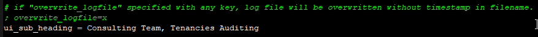
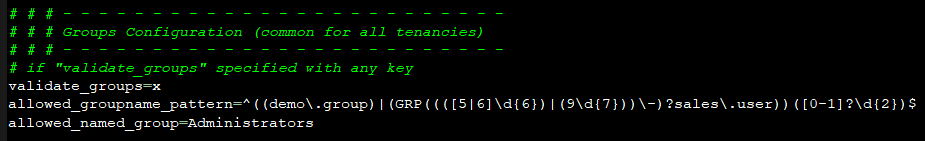

# OCI Auditing 

### <a name="toc">Table of contents [TOC]

[Background](#_Toc52579461)

[Tool GUI](#ui)

[Command-line options](#cli)

[Installation Steps](#_Toc52579462)

[Prerequisite](#_Toc52579463)

[Configurations](#config)

[Tool Demo](#_Toc52579466)

[Report Details](#_Toc52579467)

[Events](#events)

[Networking](#networks)

[Email Notifications](#email)

&nbsp;  

# Background

With the increasing demand for scale of operations in Oracle Cloud Infrastructure, visibility in managing the resources is becoming as important.

While the Audit service provides the necessary governance, however, managing it manually becomes difficult for large and ever-changing infrastructures.

"OCI Auditing Tool" helps us in mitigating the manual work and provide an automated way to govern the infrastructure with minimal effort.

* Audits & Reports on: 
    * Users, Groups, Compartments, Service Limits
    * Policies, all listed on a single sheet helps easy tracking by applying filters
    * Instances or Services used
    * Events, track every actions, and keep archive of what and all happened in your tenancies
    * Networking alerts on all OCI network components
    * Cloud Guard, get these alerts also right into this same report
* supports multiple tenancies in a one go.
* schedule daily, monthly or as needed for reporting/archiving tenancies details.
* email reports & lot more features.
* with GUI, also commandline access.

[TOC](#toc)

 

# Tool GUI
The interface would look like this:

GUI options are self-explorable, person who manages OCI, can understand UI easily.

Further how to provide tenancies list into configuration, and all other simple steps are explained in [first time usge steps](#_Toc52579462)

[TOC](#toc)

 

# Command-line options
CLI can be used for schedulers/automations.

    Commandline Usage of "OCI Auditing Tool":

    Arg 1 = Tenancy Names, each separated by a space
            complete list should be as single argument, so use double-quotes to cover the complete list
            *Mandatory argument

    Arg 2 = Type of analysis:
            compartments = list & analyse Compartments, audits naming formats
            users        = list & analyse Users, audits naming formats
            groups       = list & analyse Groups, audits naming formats
            limits       = list & analyse Service Limits, warnings on near to limits
            policies     = list & analyse Policies, audits for mandatory policies, missing policies, additional policies
            instances    = lists instances created for all the OCI services supported
            events       = list & analyse Audit Events, alerts for all create/modify/terminate events
            networks     = list & analyse VCN and all of it's sub-components, audits CIDR, Protocols
                           [planned to include all other network components in next release]
            all          = all these audits
			[select only required audits, to save big run-times. Using optimization options in configurations can save run-times.]
            *Mandatory argument

    Arg 3 : Options available as of now: sendMail
            -Optional argument

Note: 
   * All alerts are normally highlighted with suitable background colors.
   * selected analysis will always list all respective OCI components in to the report, plus auditing, unless if some components are avoided by user configurations.

[TOC](#toc)

&nbsp;  

# Installation steps for first time usage
\* Download packaged single click exe file from [releases](https://github.com/KsiriCreations/oci-auditing/releases)

\* Extract & place exe file anywhere in cloud or local Windows system.

\* Also download [configurations\tool.ini](https://github.com/KsiriCreations/oci-auditing/raw/master/configurations/tool.ini) and place inside a subfolder named `configurations`.

\* Configure tenancies, authentications and optional configurations.

[how to configure](#config) and [prerequisite](#prereq)

 

[TOC](#toc)

&nbsp;  

# Prerequisite

\* A Windows system (cloud or local) to install the tool.

\* An advanced editor is preferred. `example: notepad++`

\* Oracle Cloud Infrastructure account. https://www.oracle.com/cloud/sign-in.html

\* An OCI user.
`security best practice is to create a new user with minimal permissions required`

\* IAM policy for the user.
    
    allow group <grp_name> read all-resources in tenancy

\* RSA key pair in PEM format, to form API authentication.

\* Tenancy OCID, user OCID and fingerprint obtained after adding the public key.

\* SMTP/TLS service details for notifications (optional).

[TOC](#toc)

&nbsp;  

# <a name="config">Configurations</a>

### Configuring "tool.ini"

Get User configurations on all tenancies following as steps in: [User configurations on OCI](./doc/user_configurations_on_oci.md)

_Note: All lines starting with Hash or colon [ `# ;` ] are comment lines._

_These comment lines are just for user"s reference._

\* Copy the private key `example: oci_api_key.pem` under the `configurations` folder created during installation.
    
\* Open the `tool.ini` file in an editor and add the tenancy details.

    tenancy_name= <name of your tenancy>
    tenancy_ocid= <OCID of your tenancy>
    user_ocid = <OCID of the user>
    fingerprint = <fingerprint of the user>
    Region = <any subscribed region identifier>
    key_file = <private key local path>

\* For multiple tenancies, add multiple sets of entries as below.

[TOC](#toc)

 

# <a name="_Toc52579466">Tool Demo</a>

Once the configuration is complete, open "OCI_Auditing_Tool.exe" to launch the tool.

 

To test the connectivity, select required tenancies, click on "Options > Connection Check"

To gather audit details:

\* Select the tenancy/s on left.

\* Select the type of audits required on right.

\* Click on the green arrow button at the bottom.

This will fetch the required information from OCI and generate an audit report in .xlsx format.

The audit report along with an execution log will be stored in `results` folder.

[TOC](#toc)

 

# <a name="_Toc52579467">Report Details</a>

\* All audit data will be consolidated to one report.

\* Data will be spread across multiple tabs with respect to type of audit.

\* Report will be named along with generated time-stamp, for future differentiation between multiple reports.

 

The Audit Report tabs are outlined below.

## Tenancies

Report generation timestamp is displayed on top.

Shows basic details of tenancies like name, OCID, home-region, subscribed-regions and all Availability Domains.

 

## Users

Shows all user details fetched from selected tenancies.

### Optional configurations:

\* `allowed_username_pattern` : pattern based on your preferences

\* `allowed_named_user` : any exceptional usernames, which does not follow pattern

 

## Groups

Shows all group details fetched from selected tenancies.

### Optional configurations:

\* `allowed_groupname_pattern` : based on your preferences

\* `allowed_named_group` : any exceptional group names, which does not follow pattern

 

## Compartments

Shows all compartments, sub-compartments up to any level.

### Optional configurations:

 

[TOC](#toc)

 

## Service Limits

Shows all service-limits, scanning through all available services, and diving deep through all scopes and limits.

also, shows limit usage and availability if required.

### Optional configurations:

\* limits_alert_value : threshold for Service limit alerts

\* limits_show_used_and_available : show services used and available also

\* limits_skip_services : bypass these services

Marks row,

*   red, if usage is above the limit
*   yellow, if usage is above alert value

 

## Policies

Shows all policies present in each compartment.

Scans through every policy and all of its statements, and shows as policy statement per row format.

 

[TOC](#toc)

 

## Services Created / Instances

Shows all services created by users, scanning in to every regions, availability domains and, compartments.

These OCI services are supported: 
* Compute
* Boot Volume, and Backups
* Block Volume, and Backups
* Volume Group, and Backups
* Dedicated VM Host
* Cluster Network
* Instance Pool
* File System, Mount Target
* Analytics Instance
* Integration Instance
* Load Balancer
* Health Check: HTTP, and Ping
* DB Systems
* Autonomous Databases
* Autonomous Container Databases
* Autonomous Exadata Infrastructure
* Exadata Infrastructure
* VM Cluster
* NoSQL Table
* MySQL DB System

_You can send request for additional services to get added in to the Tool_

### Optional configurations:

 _These options are for tool runtime optimization only._

 [TOC](#toc)

 

## <a name="events">Events</a>

Shows all OCI Audit Events like creating or updating instances, listing security lists, route tables, etc.

Marks row,

\* Red upon creating or deleting a resource.

\* Yellow upon updating a resource.

\* OCI Audit Events can be collected for these date ranges:
* Past 1 hour
* Past 1 day
* Past 1 month
* All events from last run

 _These options are available on tool GUI_
 
### Optional configurations:

 

[TOC](#toc)

 

## <a name="networks">Networking</a>

### Virtual Cloud Network:
VCN [When networking is selected - by default listing]

Route Table

Subnet

Security List

Network Security Group

Internet Gateway

NAT Gateway

Service Gateway

DRG attachments to VCN

Local Peering Gateway

DRG

 

Shows VCN details such as VCN name, OCID, CIDR, etc.

### Route Table:
Shows Route Tables available along with the implemented route rules.

### Subnet:
Shows a list of all the subnets configured.

### Security List:

### Network Security Groups:

 Rows are color coded as below:

 

[TOC](#toc)

 

# <a name="email">Email Notifications</a>

If you are scheduling this tool for daily, weekly reports, then email notification feature can send the report right to your inbox.

### Configurations for Email Notifications

<u>_Note:_</u>
* _All configuration values here are just for illustration, please replace with parameters that you have setup_
* _Mailing functionality may give error if VPN or antivirus blocks the connection_

[TOC](#toc)

 

