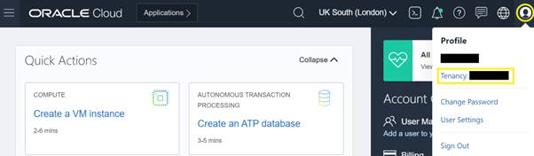
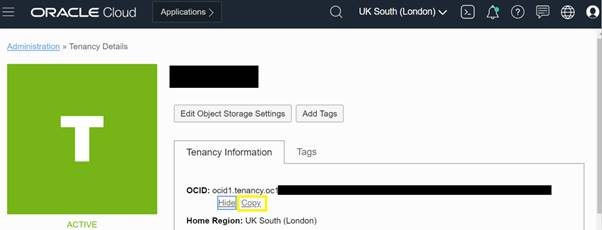
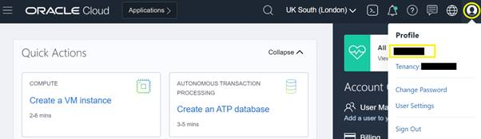
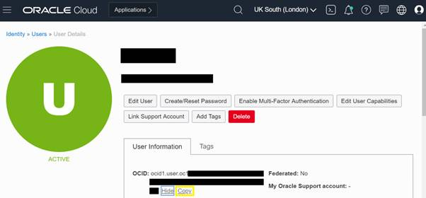
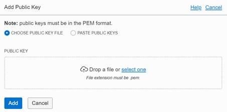
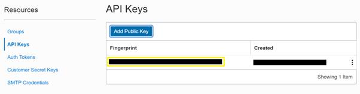

# User configurations on OCI

These mandatory details will be required for the configuration:
* RSA key pair in PEM format
* Tenancy name
* Tenancy OCID
* User OCID
* API fingerprint of the user

 
 

Login to your OCI console and click on the Profile button > Tenancy.

On the Tenancy Details page, find the OCID and click on "Show" to view the complete OCID or click on "Copy" to copy it into clipboard and paste on a notepad.

In the OCI console, click on the Profile button > Username.

On the User Details page, find the user OCID and click on "Show" to view the complete OCID or click on "Copy" to copy it into clipboard and paste on a notepad.

\* Upload the public key "oci_api_key_public.pem" generated. {[How to generate RSA key pair](./rsa_key_pair_generation.md)}

\* On the User Details page, scroll down to Resources and click on API Keys > Add Public Key.

\* Select or drop the public key and hit "Add".

\* A fingerprint will be generated. Copy this fingerprint and keep handy on a notepad.

 

_Note: In similar way, get details of all other tenancies in scope for audit._

